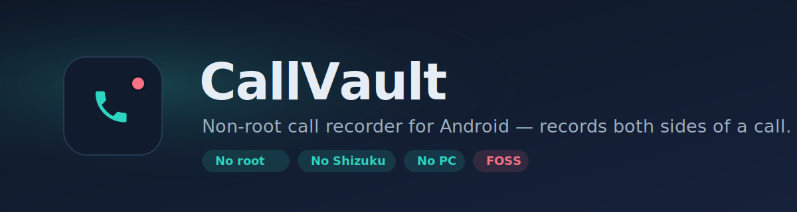
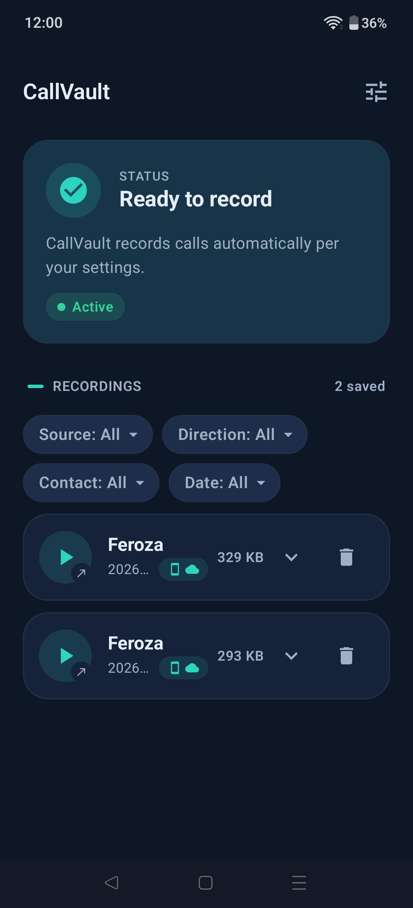
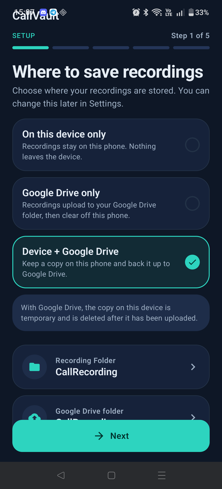
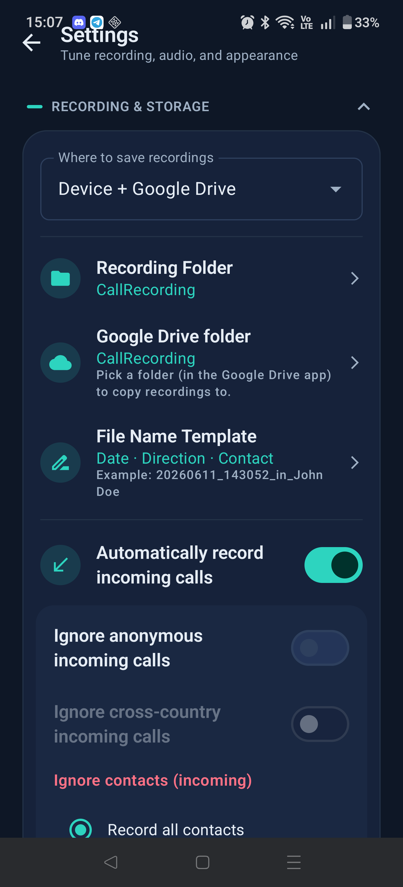

<div align="center">



[](https://github.com/madkongo/CallVault/releases/latest)
[](https://github.com/madkongo/CallVault/releases)
[](LICENSE)
[](#requirements)

</div>

> **CallVault is a fork of [ShizuCallRecorder](https://github.com/kitsumed/ShizuCallRecorder)** (Copyright © kitsumed (Med)), re-architected to run **self-contained over embedded ADB** instead of Shizuku. It is a modified, independent version — not endorsed by or affiliated with the original author. See [NOTICE.md](./NOTICE.md).

## What is CallVault?

**CallVault** is a **non-root, FOSS call recorder for Android** that records **both sides** of a phone call. It drives a privileged shell session entirely **on-device** — no root, no [Shizuku](https://github.com/RikkaApps/Shizuku), no companion PC — using an embedded ADB client ([libadb-android](https://github.com/MuntashirAkon/libadb-android)) over Android's own **Wireless Debugging**. Audio is captured through a direct on-device path, with [scrcpy-server](https://github.com/genymobile/scrcpy) as an automatic fallback.

You pair **once**; after that it's hands-free.

<div align="center">

| Home | Setup Wizard | Settings |
|:---:|:---:|:---:|
|  |  |  |

</div>

## Features

| | Feature |
|:---:|---|
| 🎙️ | Records **both sides** of incoming & outgoing calls (incl. Bluetooth / headset) |
| 📶 | **Offline recording (opt-in)** — record calls even with **no Wi-Fi network**, for calls on the road (off by default; opens a local, RSA-gated debugging port when enabled) |
| 🤖 | **Automatic** recording with per-call rules — ignore anonymous, cross-country, or specific contacts |
| ☁️ | Save to **device, a cloud folder, or both**, with optional **scheduled sync** (immediate / daily / weekly) |
| 🧹 | **Retention / auto-delete** — remove recordings after a chosen age, separately for device & cloud, swept daily at a time you pick (your local time zone) |
| ▶️ | In-app **recordings list** with playback, **contact-name** resolution, source badges, and filters |
| 🗂️ | Filter recordings by **source, direction, contact, or date**; play & delete each copy individually |
| 🎚️ | **Opus** or **AAC** at your chosen bitrate; [BCR](https://github.com/chenxiaolong/BCR)-compatible file names |
| 🔒 | **No root, no Shizuku, no PC** — everything runs on-device, Wireless Debugging is automatic & transient |
| ⬆️ | **In-app updates** — CallVault notices new GitHub releases and installs them on a tap (signature-pinned, resumable download); never auto-installs |
| 🎨 | Clean, modern UI — no telemetry, no ads, no nonsense |

## How it works

After a one-time pairing, CallVault runs a **persistent privileged daemon** — a detached `app_process` under the shell user, in the spirit of Shizuku — that **survives Wireless Debugging being turned off**. Recording commands then flow to it over **binder IPC**, so no ADB connection is needed at record time.

- **Wireless Debugging is fully automatic and transient.** CallVault turns it on only long enough to (re)launch the daemon, then turns it back off. You never toggle it manually after the first pair.
- Call audio is captured via scrcpy and muxed into a file you own (via the Storage Access Framework) — on the device and/or a cloud folder you pick through the system file picker.

## Requirements

- **Android 11 or newer** (best on Android 12+; on Android 11 the screen must be unlocked during a call).
- **Wireless Debugging** available in Developer Options.
- **Developer options must stay enabled.** If you turn Developer options off later (or an OS update
  resets it), the recorder can't run and calls come out empty — the Home screen will show a red
  **"Developer options is off"** status until you re-enable it (Wireless debugging itself stays
  automatic; you never toggle that manually).
- No root, no PC, no Shizuku.

> [!IMPORTANT]
> CallVault relies on hidden internal Android APIs and `scrcpy-server`, so it can break on new Android releases or specific OEM builds. Behavior is **non-deterministic** across devices — read the [Disclaimer](#disclaimer).

## Install

1. Download the latest **`CallVault.apk`** from the [**Releases**](https://github.com/madkongo/CallVault/releases/latest) page (or use [Obtainium](https://github.com/ImranR98/Obtainium) for auto-updates from this repo).
2. Open it and allow installing from unknown sources if prompted.

> After the first install, CallVault can update **itself** — it checks GitHub for new releases and offers a one-tap install on the Home screen (toggle off under Settings → Updates). Installing is always your choice; it never updates on its own.

> CallVault is sideloaded only — it **cannot** be on the Google Play Store (Play prohibits both call recording and the embedded-ADB privilege mechanism it depends on). F-Droid is the intended catalog.

## How to use

**One-time setup (in-app):**

1. **Enable Wireless Debugging:** *Settings → System → Developer options → Wireless debugging → On.*
   (If Developer options aren't visible: *Settings → About phone → tap "Build number" 7 times.*) — CallVault detects this and offers a shortcut.
2. **Open CallVault** and accept the disclaimer.
3. On the **Permissions** screen, grant **Notifications**, then tap **Pair**. CallVault opens the Wireless-debugging screen and waits — when you flip the toggle on, pairing starts automatically.
4. Tap **"Pair device with pairing code"**, and type the 6-digit code into CallVault's notification. After a few seconds you'll get **"Paired ✓"** — tap it to return.
5. Grant the remaining permissions, then complete the **Setup Wizard**: where to save recordings, sync schedule, auto-record, audio quality, and file-name format.

**Day-to-day:** the **Home** screen shows app status and your recordings — tap one to play, expand a *Device + Drive* recording to play/delete each copy, and filter by source/direction/contact/date. Settings is one tap away.

> [!TIP]
> On OEMs that aggressively kill background apps (OnePlus/OxygenOS, Xiaomi, etc.), allow CallVault in **Auto-launch / Startup Manager** and exclude it from **battery optimization** so it records reliably and starts after a reboot. See [dontkillmyapp.com](https://dontkillmyapp.com/).

## Building from source

This is a standard single-module Android project at the repo root. See [BUILDING.md](./BUILDING.md):

```bash
./gradlew :app:assembleDebug   # → app/build/outputs/apk/debug/app-debug.apk
```

Requires JDK 17 and the Android SDK. CallVault is **reflection-heavy** (hidden APIs, the daemon is launched by class name) — a minified release build will break it unless minification is disabled.

## Credits & attribution

CallVault is a modified fork of **[ShizuCallRecorder](https://github.com/kitsumed/ShizuCallRecorder)** by **kitsumed (Med)**; the original project's name, trademarks, and logos are the property of their owner and are used here only for this required attribution. The ADB pairing/mDNS code is adapted from [RikkaApps/Shizuku](https://github.com/RikkaApps/Shizuku) (Apache-2.0).

Built on the work of:
- [ShizuCallRecorder](https://github.com/kitsumed/ShizuCallRecorder) — the upstream project this is forked from
- [scrcpy](https://github.com/genymobile/scrcpy) — the audio-capture server
- [libadb-android](https://github.com/MuntashirAkon/libadb-android) — the embedded ADB client

## License

Licensed under the [GNU General Public License v3.0](LICENSE). ⚠️ **Additional Terms** under GPLv3 Section 7 apply (at the end of the license file), including trademark protection and the mandatory fork-attribution requirements that this project complies with.

> CallVault is **not affiliated with, endorsed by, or supported by** kitsumed/ShizuCallRecorder, Shizuku, scrcpy, or Google/Android. "Android" is a trademark of Google LLC.

## Disclaimer

**Recording phone calls may be subject to complex and varying laws in different countries and jurisdictions.** You may need consent from all parties before recording. The developers and contributors are **not responsible** for any misuse or legal consequences. Learn more: [Telephone call recording laws](https://en.wikipedia.org/wiki/Telephone_call_recording_laws). **This is not legal advice** — consult a legal professional for your situation. It is **your responsibility** to verify that CallVault's behavior on your device complies with your local laws, and to stop immediately any activity that would constitute a legal infraction.
