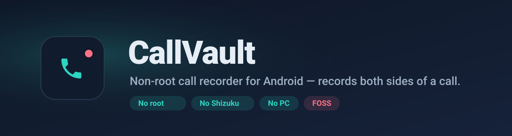

<div align="center">



[](https://github.com/madkongo/CallVault/releases/latest)
[](https://github.com/madkongo/CallVault/releases)
[](LICENSE)
[](#requirements)
[](#two-ways-to-run-it)

**Records your calls, transcribes them, and summarises them — all on the phone itself.**

Free, no ads, no accounts. Nothing leaves your phone unless you switch on Drive backup.

</div>

Recording call audio needs shell-level privilege. CallVault gets it one of two ways — pick either in the setup wizard, and switch whenever you like:

| **Built-in** (default) | **Shizuku** |
|---|---|
| Pairs once, on the phone itself. No other app, no PC. | Already run [Shizuku](https://github.com/RikkaApps/Shizuku)? Nothing to pair — choose it and go. |

[Compare the two ↓](#two-ways-to-run-it)

> **CallVault is a fork of [ShizuCallRecorder](https://github.com/kitsumed/ShizuCallRecorder)** (Copyright © kitsumed (Med)), re-architected to run **self-contained over embedded ADB**, so it no longer needs Shizuku — and still runs through it, as a second mode, if you prefer. It is a modified, independent version — not endorsed by or affiliated with the original author. See [NOTICE.md](./NOTICE.md).

## What it does

- 🎙️ **Phone calls, both sides** — automatically, or ask-me-each-time.
- 💬 **App calls** — WhatsApp, Signal, Telegram and others, and you pick which apps get recorded. Opt-in, experimental.
- 🎛️ **Controls while you talk** — pause, resume, stop, or mark a moment to find again later. On phone calls and app calls alike.
- 🔗 **Merge calls that were one conversation** — a call drops and you ring back; join them into one recording, in the order you choose. Lossless, and un-mergeable afterwards.
- 📝 **Transcripts** — 13 languages, written on the phone.
- 🧾 **Summaries** — intent, key points, decisions, action items.
- 🗣️ **Speaker labels** — who said which line, on phone calls.
- 🔎 **Full-text search** across transcripts, summaries and your own notes.
- 🏷️ **Tags and stars** — label a call, star the ones worth keeping, filter the list by either.
- 📤 **Export a transcript** as text, Markdown, SRT, VTT or JSON.
- ▶️ **Playback with a waveform** you can scrub, plus a note per call.
- 🔒 **App lock** — your phone's own unlock, required before any recording or transcript is shown. Optional.
- ☁️ **Google Drive backup** — optional.
- 🧹 **Housekeeping** — delete recordings past a chosen age, cap how much space they may use, or drop very short ones. All off by default, and a starred recording is never deleted automatically.
- 🔔 **Says when it has stopped working** — if recording can't start after a reboot, or recordings stop reaching Drive, it tells you rather than leaving you to find out from a call that is not there.
- 🔄 **In-app updates** — checks GitHub, verifies the signature, installs on your tap. Never on its own.

Recordings are Opus in an `.ogg` file at 24 kbps by default (AAC/`.m4a` also available, 8–128 kbps), saved to a folder you pick and can open in any other app. CallVault can also write BCR's metadata file beside each recording — off by default — so tools built for BCR, such as [bcr-gui](https://github.com/nicorac/bcr-gui), can read your calls' details.

> [!NOTE]
> App-call capture depends on your phone's audio stack and on each app's own build. Verified so far on OnePlus 12 (OxygenOS 16) and Galaxy S24 FE (One UI 8.5) — reports welcome. Carrier Wi-Fi calling (VoWiFi/VoLTE) is **not** covered, and an app call that starts before CallVault is ready is lost rather than recorded late — the routing is fixed the moment the call begins. Bluetooth headsets are fine, including AirPods; only LE Audio is untested.

<div align="center">

| Recordings | Playback & summary | Transcript |
|:---:|:---:|:---:|
|  |  |  |

| Search | Transcription settings | Settings |
|:---:|:---:|:---:|
|  |  |  |

</div>

## Transcripts and summaries

Both run on the phone, on the CPU, with no account and no network.

**Transcription** uses [whisper.cpp](https://github.com/ggerganov/whisper.cpp). Two models — 190 MB, or 574 MB for better quality — downloaded once over Wi-Fi.

**Summaries** use [llama.cpp](https://github.com/ggerganov/llama.cpp) with Google's Gemma. It is a 2.6 GB download and needs a similar amount of memory to run, so it wants a recent phone; CallVault states the cost before it downloads anything.

**Speaker labels** come from the call's own two channels, not from a voice model, so they cost nothing extra. One tap tells CallVault which side is you, and it renames every past phone call too. App calls stay as Speaker A and Speaker B.

> [!NOTE]
> Pick your language rather than leaving it on auto-detect — detection is unreliable and can transcribe a language phonetically into the wrong alphabet. A long call is transcribed in passes and takes a while, but it is not refused.

## What leaves your device

| | Leaves the phone? |
|---|---|
| Recordings | Only if **you** turn on Google Drive backup |
| Transcripts, summaries, notes | Never |
| Speaker names, contacts, call log | Never |
| Analytics, telemetry, crash reports | None exist |

CallVault reaches the network in three places, and nowhere else: **GitHub**, to check for a new release (on by default, roughly daily); **Hugging Face**, to download a model you asked for; and **your local network** during pairing, to find the phone's own debugging service. Drive backup goes through Android's own file picker using the Drive app already on your phone — there is no login in CallVault, and it never talks to Google's servers itself.

## Requirements

- **Android 11+**, 64-bit ARM (`arm64-v8a`). On Android 11 the screen must stay unlocked during a call.
- **Developer options stay on** — in built-in ADB mode. Turn them off and recordings come out empty; the Home screen warns you.
- Room for a model if you want transcripts (190 MB or 574 MB) or summaries (2.6 GB, plus the memory to run it).

> [!IMPORTANT]
> CallVault leans on hidden Android APIs, so behaviour varies by OEM and can break on a new Android release. On phones that aggressively kill background apps (OxygenOS, MIUI, One UI), allow it in Auto-launch and exclude it from battery optimisation — see [dontkillmyapp.com](https://dontkillmyapp.com/).
>
> **On OPPO, OnePlus and Realme phones there is one extra switch to flip before anything works** — see [below](#on-oppo-oneplus-and-realme-phones).

## Two ways to run it

**Built-in mode is CallVault's own, and the default.** It pairs once, on the phone, and needs no second app at all. It is the default because it can do more, not because Shizuku is an afterthought.

**Already running Shizuku? CallVault supports it directly.** Choose Shizuku mode and there is nothing to pair, no wireless debugging to switch on, and CallVault starts no debugging of its own — it borrows the privilege Shizuku already holds. Phone calls record, and everything that happens afterwards — transcripts, summaries, search, tags, playback and export — is identical. What differs is capture-side only.

Switch whenever you like; any setting a mode couldn't honour comes back when you switch away. The table is the honest difference between the two.

| | Built-in mode | Shizuku mode |
|---|:---:|:---:|
| **In both modes** | | |
| Phone calls, both sides | ✅ | ✅ |
| Transcripts, summaries, search, tags, playback and export | ✅ | ✅ |
| **Where they differ** | | |
| Works without installing another app | ✅ | ❌ |
| Nothing to pair, and no wireless debugging of CallVault's own | ❌ | ✅ |
| Recording works after a reboot, with nothing to do | ✅ | ❌ |
| App calls (opt-in) | ✅ | ❌ |
| Speaker labels | ✅ | ❌ |
| Keeps recording if Android kills the background process (opt-in) | ✅ | ❌ |
| Recording away from Wi-Fi (opt-in) | ✅ | ❌ |
| Full bug-report export | ✅ | ❌ |

> [!NOTE]
> Recording away from Wi-Fi is armed over your network, and a reboot clears it. It comes back as soon as the phone joins *any* Wi-Fi network for a few seconds — it needs no internet, and a café or a hotspot will do. CallVault says when that is needed, so a missed call is not how you find out.

## Install

Download **`CallVault.apk`** from [Releases](https://github.com/madkongo/CallVault/releases/latest), or add the repo to [Obtainium](https://github.com/ImranR98/Obtainium) for automatic updates.

> [!IMPORTANT]
> Recording calls is regulated, and the rules differ sharply between countries and states — often every party must consent. This is your responsibility, not the app's. Where it helps, you can turn recording off for individual apps, or have CallVault ask each time rather than record automatically. Read the [disclaimer](#disclaimer) before you use it.

CallVault can't be on Google Play — Play bans both call recording and the privilege mechanism it depends on. F-Droid is planned.

Then open it and follow the setup wizard: accept the disclaimer, grant permissions, pair once (or pick Shizuku), and choose where recordings are saved.

### Pairing, step by step

1. Turn on **Wireless debugging** — *Settings → System → Developer options*. CallVault detects it and offers a shortcut if it's off.
2. On CallVault's Permissions screen, tap **Pair**. It opens the Wireless-debugging screen and waits.
3. Tap **Pair device with pairing code** and type the six digits into CallVault's notification.
4. **Paired ✓** — tap it to go back and finish the wizard.

If a recording stops when you lock the screen, set **Default USB configuration** to **Charging only**. CallVault offers this during setup and from Settings.

> [!WARNING]
> **Not while you are using Shizuku, and not during a call.** Changing the Default USB configuration
> restarts Android's debugging service. Shizuku's server is hosted by it and stops too, so you would
> have to start Shizuku again before anything could be recorded — and doing it mid-call ends the
> recording in progress. CallVault now declines the change while a recording is live.

> [!WARNING]
> Keep the pairing: uninstalling CallVault wipes it and there is no way to restore it — you pair again from scratch.

### On OPPO, OnePlus and Realme phones

ColorOS, OxygenOS and Realme UI refuse ADB permission grants out of the box. CallVault pairs, and then the privilege it needs is quietly denied — so recordings never start. **This affects Shizuku mode too**; Shizuku reports it as *"the permission of adb is limited"*.

One switch fixes it, and it is not in an obvious place:

1. Open *Settings → System → Developer options*.
2. Scroll to the **bottom of the Apps section** — it is the last item there.
3. Turn on **Disable system optimization**. Older builds call it **Disable permission monitoring**.

**Can't see it?** It is hidden in some translations, which is why people conclude their update removed it. Set the phone's language to **English**, turn the switch on, then set the language back — it stays on.

Flip it *before* pairing. If you already paired, restart CallVault afterwards: a session that started earlier keeps the permissions it had at the time.

## Get in touch

**[Join the CallVault group on Telegram](https://t.me/+GmXjAcXxXh42Y2I8)** — the quickest way to ask a
question, report something odd, or hear about a new build. Bug reports are still welcome as
[GitHub issues](https://github.com/madkongo/CallVault/issues), which is the better place for anything that
needs a log attached.

## What's next

- **Speaker names for app calls** — WhatsApp and Signal transcripts still read "Speaker A"; phone calls already get real names.
- **F-Droid** — so updates arrive through a store rather than a download.

## Building from source

```bash
git clone --recursive https://github.com/madkongo/CallVault.git
cd CallVault
./gradlew assembleRelease
```

Needs JDK 17, the Android NDK (`27.2.12479018`) and CMake — the transcription and summary engines are built from source. Without a keystore at `signing/callvault-signing.keystore` the release APK builds **unsigned**; sign it yourself before installing.

Code shrinking stays **off**: the privileged recorder is launched out-of-process by `app_process` from a class named in a string, so R8 cannot see it as reachable and strips it.

## Credits & attribution

CallVault is a modified fork of [ShizuCallRecorder](https://github.com/kitsumed/ShizuCallRecorder) by [kitsumed (Med)](https://github.com/kitsumed); the original project's name, trademarks, and logos are the property of their owner and are used here only for this required attribution. The ADB pairing/mDNS code is adapted from [RikkaApps/Shizuku](https://github.com/RikkaApps/Shizuku) (Apache-2.0).

Built on the work of:

- [scrcpy](https://github.com/Genymobile/scrcpy) — the fallback audio-capture server
- [libadb-android](https://github.com/MuntashirAkon/libadb-android) — the embedded ADB client
- [whisper.cpp](https://github.com/ggerganov/whisper.cpp) and [llama.cpp](https://github.com/ggerganov/llama.cpp) — on-device transcription and summaries
- [Gemma](https://ai.google.dev/gemma) by Google — the summarisation model, Apache-2.0, downloaded on request rather than bundled

## License

Licensed under the [GNU General Public License v3.0](LICENSE). ⚠️ **Additional Terms** under GPLv3 Section 7 apply (at the end of the license file), including trademark protection and the mandatory fork-attribution requirements that this project complies with.

> CallVault is **not affiliated with, endorsed by, or supported by** kitsumed/ShizuCallRecorder, Shizuku, scrcpy, or Google/Android. "Android" is a trademark of Google LLC.

## Disclaimer

**Recording phone calls may be subject to complex and varying laws in different countries and jurisdictions.** You may need consent from all parties before recording. The developers and contributors are **not responsible** for any misuse or legal consequences. Learn more: [Telephone call recording laws](https://en.wikipedia.org/wiki/Telephone_call_recording_laws). **This is not legal advice** — consult a legal professional for your situation. It is **your responsibility** to verify that CallVault's behavior on your device complies with your local laws, and to stop immediately any activity that would constitute a legal infraction.
